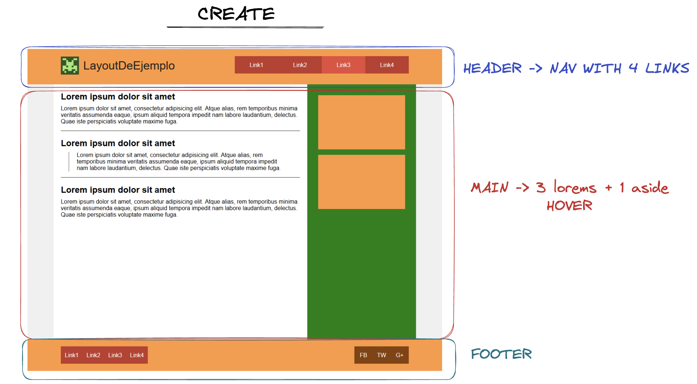

# CREATE TEST

- Hi there people! 👋🏻
- My name is Laia Ruiz Martínez and this is a Create technical test.

## 🛠 | Tools and programming languages:

- HTML
- CSS

## -- About this project: --

This project showcases a responsive website developed using HTML and CSS, following the BEM (Block, Element, Modifier) methodology. Its primary objective is to create a visually appealing and user-friendly website that adheres to industry best practices in web development. By employing the BEM methodology, the HTML and CSS code are kept clean, maintainable, and easily comprehensible.

## -- Organization: --

## -- Made: --

Made with ❤️ by [Laia](https://github.com/LaiaRuizM)

## -- Getting Started 💪🏼☄️ --

1. Clone the repo:
   `git clone https://laiaruizm.github.io/create-test/`

1. Install NPM packages:
   `npm install`

1. Start the project:
   `npm start`
